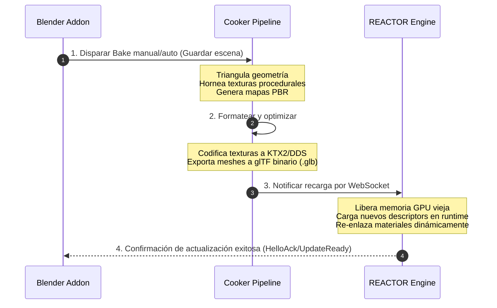

# 🩸 REACTOR ⇄ Blender Live Link — Guía de Sincronización en Tiempo Real

```text
    ██████╗ ███████╗ █████╗  ██████╗████████╗ ██████╗ ██████╗ 
    ██╔══██╗██╔════╝██╔══██╗██╔════╝╚══██╔══╝██╔═══██╗██╔══██╗
    ██████╔╝█████╗  ███████║██║        ██║   ██║   ██║██████╔╝
    ██╔══██╗██╔══╝  ██╔══██║██║        ██║   ██║   ██║██╔══██╗
    ██║  ██║███████╗██║  ██║╚██████╗   ██║   ╚██████╔╝██║  ██║
    ╚═╝  ╚═╝╚══════╝╚═╝  ╚═╝ ╚═════╝   ╚═╝    ╚═════╝ ╚═╝  ╚═╝
              ⇄  B L E N D E R   L I V E   L I N K  ⇄
```

Bienvenido a la guía definitiva de **REACTOR Live Link**, el sistema de sincronización bidireccional y en tiempo real diseñado para comunicar **Blender** (entorno de diseño 3D/DCC) con el motor gráfico de alto rendimiento **REACTOR Vulkan Crate**.

Con este sistema, puedes mover, rotar y escalar objetos en la interfaz de Blender y ver los resultados reflejados en tiempo real con latencias inferiores a **1 ms** directamente en tu aplicación Vulkan en ejecución.

---

## 🚀 Inicio Rápido en 3 Pasos

### Paso 1: Generar el archivo Addon (.zip)
REACTOR incluye un script automatizado que empaqueta todos los módulos del puente (protocolo, encoders, handlers de depsgraph y UI) en un único archivo ZIP listo para instalar.

Abre una terminal (PowerShell o CMD) en este directorio y ejecuta:
```powershell
python empaquetar_addon.py
```
*Esto generará el archivo `reactor_live_link.zip` en esta misma carpeta.*

### Paso 2: Instalar en Blender (Incluido Blender de Steam)
El addon es totalmente compatible con las versiones de Blender 4.2+ (incluidas las distribuciones de **Steam**).

1. Abre **Blender**.
2. Dirígete a **Edit ➔ Preferences ➔ Add-ons** (o *Extensions* en versiones más recientes).
3. Haz clic en la esquina superior derecha en la flecha de menú o botón **Install from Disk...** (o **Install...**).
4. Selecciona el archivo generado `reactor_live_link.zip` y haz clic en **Install Add-on**.
5. Activa la casilla de verificación junto a **REACTOR Live Link** para habilitar el addon.

> [!NOTE]
> **Blender de Steam:** Si utilizas Blender mediante Steam, el addon se instalará y registrará de forma idéntica, ya que Steam guarda las preferencias de usuario y addons en la carpeta de AppData local de Windows `%USERPROFILE%\AppData\Roaming\Blender Foundation\Blender\`, garantizando compatibilidad absoluta sin importar si ejecutas la versión portable, instalador o de Steam.

### Paso 3: Ejecutar y Conectar
1. Abre tu terminal de desarrollo en la raíz del proyecto **REACTOR** y ejecuta el ejemplo de sincronización en vivo:
   ```powershell
   cargo run --example blender_live
   ```
   *Verás el espectacular banner de inicio de REACTOR esperando conexiones en el puerto WebSocket `19840`.*

2. Vuelve a Blender. Abre el panel lateral **N-Panel** pulsando la tecla `N` en el 3D Viewport.
3. Haz clic en la nueva pestaña **REACTOR**.
4. Haz clic en **Conectar a REACTOR**.
5. **¡El milagro de la sincronización en tiempo real está activo!** Mueve el cubo de Blender o crea nuevos objetos (añadiendo meshes) y observa cómo se replican instantáneamente en la ventana del motor Vulkan. Pulsa `ESC` en la ventana del motor para salir de forma limpia.

---

## 📐 Transformación Matemática de Coordenadas

Blender y Vulkan/REACTOR utilizan sistemas de coordenadas diferentes que requieren una conversión matemática precisa en tiempo real para evitar que los objetos aparezcan volteados o invertidos.

### Los Dos Espacios:
*   **Blender (Z-Up, Right-Handed):**
    *   Eje $X$ apunta a la derecha.
    *   Eje $Y$ apunta hacia atrás/adelante.
    *   Eje $Z$ apunta hacia arriba.
*   **REACTOR (Y-Up, Right-Handed):**
    *   Eje $X$ apunta a la derecha.
    *   Eje $Y$ apunta hacia arriba.
    *   Eje $Z$ apunta hacia adelante.

### La Matriz de Cambio de Base ($M_{B\to R}$):
Para trasladar cualquier matriz de transformación de Blender a REACTOR, realizamos una rotación de $-90^\circ$ sobre el eje X. Esta matriz de cambio de base se define de la siguiente manera:

$$M_{B\to R} = \begin{pmatrix} 1 & 0 & 0 & 0 \\ 0 & 0 & 1 & 0 \\ 0 & -1 & 0 & 0 \\ 0 & 0 & 0 & 1 \end{pmatrix}$$

Para cualquier posición $(x, y, z)$ en el espacio de Blender:
$$X_R = X_B$$
$$Y_R = Z_B$$
$$Z_R = -Y_B$$

Y para la matriz de transformación del mundo completa de un objeto ($T_{Blender}$), el addon realiza la multiplicación homóloga para obtener $T_{Reactor}$:
$$T_{Reactor} = M_{B\to R} \cdot T_{Blender} \cdot M_{B\to R}^{-1}$$

---

## 🔗 Estructura del Addon y Protocolo WebSocket

El puente funciona sobre un protocolo WebSocket minimalista de bajísima sobrecarga. Los mensajes utilizan el formato **JSON** estructurado de la siguiente forma:

### Payload de TransformUpdated
Se envía de forma automática cada vez que modificas cualquier objeto geométrico en el viewport de Blender (gracias al callback `depsgraph_update_post`):

```json
{
  "type": "TransformUpdated",
  "data": {
    "id": "Cube",
    "matrix": [
      1.0, 0.0, 0.0, 0.0,
      0.0, 1.0, 0.0, 0.0,
      0.0, 0.0, 1.0, 0.0,
      0.0, 2.5, 0.0, 1.0
    ]
  }
}
```
*(Donde `matrix` es un array plano de 16 floats en formato Row-Major que representa la matriz de transformación mundial convertida).*

---

## 🧪 Pipeline de Cocinado e Importación Automática (Baking Workflow)

Cuando trabajas en proyectos AAA, la sincronización de transformaciones es sólo el primer paso. El sistema de REACTOR está diseñado para soportar un flujo completo de cocinado (Baking) en segundo plano:



---

## 🛠️ Resolución de Problemas (Troubleshooting)

### 1. El estado muestra "Error: [WinError 10061] No se puede establecer una conexión..."
*   **Causa:** El servidor de REACTOR no está corriendo en segundo plano.
*   **Solución:** Asegúrate de ejecutar `cargo run --example blender_live` antes de hacer clic en **Conectar** en Blender.

### 2. El addon no aparece en el panel lateral N-Panel
*   **Causa:** El addon no se ha activado en las preferencias, o la versión de Blender es antigua.
*   **Solución:** Asegúrate de usar Blender 4.2 o superior. Ve a Preferencias de Blender, busca "REACTOR Live" y asegúrate de que la casilla esté marcada. Pulsa la tecla `N` en el 3D Viewport para desplegar las pestañas laterales.

### 3. Latencias elevadas o cortes de conexión
*   **Causa:** Uso de redes VPN activas o firewalls de Windows bloqueando puertos locales.
*   **Solución:** Añade una regla de exclusión para el puerto `19840` en tu Firewall de Windows o conéctate utilizando la IP de loopback `127.0.0.1`.
