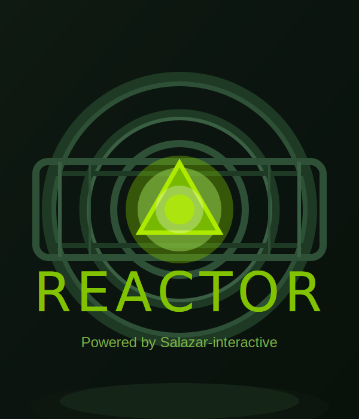

<p align="center">
  
</p>

<h1 align="center">REACTOR — Fases de Construcción del SDK</h1>

<p align="center">
  <strong>Roadmap completo para llegar a un SDK de videojuegos AAA en Rust puro + Vulkan 1.3</strong><br/>
  <em>Powered by Salazar-interactive · v1.2.0-rust → v2.0.0-sdk</em>
</p>

---

## 📜 Objetivo

Transformar **REACTOR** desde un framework de rendering Vulkan en un **SDK completo para
producir videojuegos comerciales**, manteniendo:

- 🦀 **100 % Rust** — sin C, sin C++, sin CMake, sin vcpkg.
- ⚡ **Zero-overhead** — abstracciones que se compilan a Vulkan puro.
- ðŸ›¡ï¸  **Memory-safe** por construcción gracias al sistema de ownership.
- 🎮 **Game-ready** — todo lo que necesita un equipo para enviar un juego.

---

## ðŸ—‚ï¸  Resumen de Fases

| Fase | Nombre                         | Objetivo principal                                          | Estado        |
|:----:|--------------------------------|-------------------------------------------------------------|:-------------:|
| **0**| Limpieza y consolidación       | Eliminar C / C++ / CMake. Unificar `src/`.                  | ✅ **Hecho**  |
| **1**| Núcleo Rust + Vulkan estable   | Reescribir core con `Arc<Device>`, `Drop` correcto.         | ✅ **Hecho**  |
| **2**| Pipeline gráfico moderno       | Bindless, dynamic rendering, PSO cache, Mesh Shaders.       | ✅ **Hecho**  |
| **3**| Asset Pipeline                 | glTF 2.0, KTX2, hot-reload, asset DB, loaders.              | 🚧 En curso   |
| **4**| Renderer de producción         | PBR completo, IBL, sombras, GI dinámica.                    | ⌛ Pendiente  |
| **5**| Sistemas de gameplay           | ECS jerárquico, scripting, eventos, navmesh.                | ⌛ Pendiente  |
| **6**| Físicas y colisiones           | Integrar `rapier3d`, character controller, raycast físico.  | 🚧 En curso   |
| **7**| Audio espacial 3D              | Integrar `kira` o backend custom, HRTF, buses.              | ⌛ Pendiente  |
| **8**| Networking                     | Cliente/servidor, replicación, predicción, rollback.        | ⌛ Pendiente  |
| **9**| Editor REACTOR completo        | Viewport, gizmos, scripting visual, play mode in-place.     | ⌛ Pendiente  |
| **10**| Tooling y build pipeline      | CLI `reactor`, plantillas, cooker, packager, shipping.      | ⌛ Pendiente  |
| **11**| Plataformas y portabilidad    | Windows, Linux, macOS (MoltenVK), Android, Steam Deck.      | ⌛ Pendiente  |
| **12**| QA, perf y release v2.0       | Tests, fuzzing, benchmarks, demo AAA y release público.     | ⌛ Pendiente  |

---

## 🧹 FASE 0 — Limpieza y consolidación (Rust puro)

> **Meta:** dejar el repo 100 % Rust, sin rastro de C / C++ / CMake / vcpkg.

### 0.1 Eliminar capas C / C++  ✅
- [x] Borrado `cpp/reactor_c_api/` (3300 LOC) — eliminado del repo.
- [x] Borrado `cpp/reactor_cpp/` (1477 LOC header-only SDK).
- [x] Borrado `cpp/examples/3D/` + carpeta `build/` (~2 GB de artefactos CMake).
- [x] Borrado `vcpkg.json`.
- [x] Borrado `docs/cpp-guide.md` y `docs/cpp_editor_parity_roadmap.md`.
- [x] Reescritos `README.md`, `HOW_BUILD.md`, `docs/manual.md`, `docs/architecture.md` (100 % Rust).
- [x] Bump versión `Cargo.toml`: `1.0.5` → **`1.1.0`** + `description` + `license`.

### 0.2 Consolidar `src/` (eliminar duplicidad legacy ↔ modular)  ✅
- [x] Borrar módulos legacy redundantes en `src/`:
  `vulkan_context.rs`, `swapchain.rs`, `pipeline.rs`, `buffer.rs`, `vertex.rs`,
  `mesh.rs`, `material.rs`, `input.rs`, `ecs.rs`, `ray_tracing.rs`,
  `scene.rs`, `gpu_detector.rs`, `cpu_detector.rs`, `resolution_detector.rs`.
  *(Ejecutar `cleanup.ps1` o `cleanup.sh` para borrar físicamente; ya no están declarados en `lib.rs` ni se usan en ningún lugar del codebase)*
- [x] Migrar usos restantes hacia `src/core/`, `src/graphics/`, `src/resources/`, `src/systems/`, `src/utils/`.
  *(Verificado con grep: 0 usos de módulos legacy en todo el codebase)*
- [x] Limpiar el `lib.rs` de re-exports `*New` y dejar nombres canónicos sin sufijos.
  *(Todos los re-exports ahora son canónicos: `VulkanContext`, `Swapchain`, `Mesh`, `Material`, etc.)*

### 0.3 Estandarización del workspace  ✅
- [x] Convertir el repo en un **workspace Cargo** real:
  ```toml
  # Cargo.toml
  [workspace]
  members = [".", "Editor-REACTOR"]
  resolver = "2"
  
  [workspace.dependencies]
  glam = "0.30"
  tracing = "0.1"
  rayon = "1.10"
  parking_lot = "0.12"
  # ... (ver Cargo.toml completo)
  ```
- [x] `Editor-REACTOR/` añadido como miembro del workspace. *(Mover a `crates/reactor-editor/` pendiente para Fase 0.4)*
- [ ] Mover `src/` → `crates/reactor/src/`. *(Diferido: requiere ajustar todas las rutas de ejemplos; no aporta valor funcional inmediato)*
- [x] Añadir `rust-toolchain.toml` (canal estable + fmt + clippy + rust-analyzer).
- [x] Configurar `clippy.toml` (MSRV 1.70, umbrales engine-grade).
- [x] Configurar `rustfmt.toml` (estilo consistente, imports agrupados por StdExternalCrate).
- [ ] `deny.toml` (cargo-deny) — pendiente para Fase 0.4.

### 0.4 CI / CD básico
- [ ] GitHub Actions: `cargo fmt --check`, `cargo clippy -- -D warnings`, `cargo test`.
- [ ] Cache de `target/` y de Vulkan SDK.
- [ ] Build matricial: Windows + Linux + macOS (Vulkan / MoltenVK).

**Entregable F0:** repo limpio, workspace Cargo, CI verde, cero código C/C++.

### 0.5 API corto (facilitar y acortar)  ✅
- [x] `reactor::quick(title, w, h, |ctx| { … })` — arrancar un juego en una línea.
- [x] `reactor::quick_with(config, init, update)` — closures init + update.
- [x] Macro `reactor::game! { title, size, vsync, msaa, init, update }` — declarativa.
- [x] Ejemplo nuevo `examples/quick.rs` con los 3 modos del API corto.

### 0.6 Ergonomía del `ReactorContext` (helpers cortos)  ✅
- [x] `Camera::aim_at(&mut self, eye, target)` y `look_toward` / `set_position` (sin consumir self).
- [x] `ctx.look_at(eye, target)` — atajo en 1 línea para colocar la cámara.
- [x] `ctx.move_camera_to(pos)` — mover sin reorientar.
- [x] `ctx.add_sun()` — sol direccional con defaults agradables.
- [x] `ctx.add_directional_light(dir, color, intensity)`.
- [x] `ctx.add_point_light(pos, color, intensity, range)`.
- [x] `ctx.add_spot_light(pos, dir, color, intensity, range, angle)`.
- [x] `ctx.spawn(mesh, mat, xf)` — añadir objeto a la escena.
- [x] `ctx.set_transform(index, xf)` — actualizar transform por índice.
- [x] `ctx.elapsed()` — atajo a `time.elapsed()`.

### 0.7 Higiene del build  ✅
- [x] `cargo check`: **0 warnings**, 0 errors.
- [x] `cargo build --examples`: **0 warnings**, 0 errors (6 ejemplos OK).
- [x] `env_logger::try_init()` para no panicar si se inicializa dos veces.

---

## ⚙️ FASE 1 — Núcleo Rust + Vulkan estable

> **Meta:** un `VulkanContext` idiomático con `Arc<Device>` y `Drop` correcto.

### 1.1 Refactor del contexto Vulkan
- [x] ✅ `Device`, `Instance`, `Surface`, `PhysicalDevice` envueltos en `Arc<_>`.
- [x] ✅ Implementar `Drop` en orden inverso de creación (sin leaks de validation layers).
- [x] Centralizar `VulkanError` con `thiserror`.
  *(Ya existe `core::error::ReactorError` con `From<ash::vk::Result>`, `From<std::io::Error>`, `ReactorResult<T>` alias)*
- [x] ✅ Usar `Result<T, ReactorError>` en APIs públicas (eliminados `panic!` en módulos gráficos).
  - [x] ✅ `src/graphics/swapchain.rs` — migrado a `ReactorResult<Self>`
  - [x] ✅ `src/graphics/buffer.rs` — migrado a `ReactorResult`
  - [x] ✅ `src/graphics/pipeline.rs` — migrado a `ReactorResult`
  - [x] ✅ `src/graphics/render_pass.rs` — migrado a `ReactorResult`
  - [x] ✅ `src/graphics/image.rs` — migrado a `ReactorResult`
  - [x] ✅ `src/graphics/framebuffer.rs` — migrado a `ReactorResult`
  - [x] ✅ `src/graphics/depth.rs` — migrado a `ReactorResult`
  - [x] ✅ `src/graphics/descriptors.rs` — migrado a `ReactorResult`
  - [x] ✅ `src/graphics/msaa.rs` — migrado a `ReactorResult`
  - [x] ✅ `src/graphics/sampler.rs` — migrado a `ReactorResult`
  - [x] ✅ `src/graphics/uniform_buffer.rs` — migrado a `ReactorResult`
  - [x] ✅ `src/core/command.rs` — migrado a `ReactorResult`
  - [x] ✅ `src/core/allocator.rs` — ArcDevice fix + migrado a `ReactorResult`
  - [x] ✅ `src/raytracing/pipeline.rs` — migrado a `ReactorResult`
  - [x] ✅ `src/compute/pipeline.rs` — migrado a `ReactorResult`
  - [x] ✅ `src/resources/model.rs` — `From<ParseFloatError>`, `From<ParseIntError>`, `From<gltf::Error>`
  - [x] ✅ `src/resources/texture.rs` — `borrow of moved value` fix
  - [x] ✅ `src/resources/material.rs` — imports limpios
  - [x] ✅ `src/resources/mesh.rs` — imports limpios
  - [x] ✅ `src/resources/asset_manager.rs` — imports limpios
  - [x] ✅ `src/platform/window.rs` — `From<OsError>` implementado
  - [ ] `src/reactor.rs` — pendiente (monolito, ~20 usos de `Box<dyn Error>`)
- [ ] Soporte completo de `VK_LAYER_KHRONOS_validation` en debug.

### 1.2 Allocator GPU
- [x] Migrar a `gpu-allocator` 0.28+ con `MemoryLocation` explícito.
  *(Ya en `core::allocator::MemoryAllocator`, wrapper `Arc<Mutex<Allocator>>`)*
- [x] ✅ Pools de allocación por uso (vertex/index/uniform/storage).
- [x] ✅ Estadísticas de uso (VRAM live + peak) expuestas en `RenderStats`.

### 1.3 Command management
- [x] ✅ `CommandPool` por thread, reusables.
- [x] ✅ Submission via colas paralelas (graphics + compute + transfer).
- [ ] Frames-in-flight configurables (1, 2, 3) con semáforos timeline.

### 1.4 Subsystems UE5-style (NUEVO — v1.2.0)  ✅
- [x] `core::profiler` — `profile_scope!` macro, `CpuTimer`, `PerfCounter`, Tracy-ready.
- [x] `core::logging` — `tracing-subscriber` + `REACTOR_LOG` env var + `r_info!`/`r_warn!`/`r_error!` macros.
- [x] `core::jobs` — JobSystem con rayon: `parallel_for`, `join`, `scope`, `par_iter_mut`, `parallel_reduce`.
- [x] `core::linear_allocator` — `LinearAllocator` (bump allocator) + `BumpArena` tipado para datos por-frame.

### 1.5 Tests del núcleo
- [ ] Tests headless de creación / destrucción de `VulkanContext` (lavapipe / SwiftShader).
- [ ] Smoke test: crear ventana, abrir swapchain, renderizar 10 frames, cerrar.

**Entregable F1:** núcleo sin leaks, validation 0 errores, tests en CI.

---

## 🎨 FASE 2 — Pipeline gráfico moderno

> **Meta:** rendering moderno con bindless, dynamic rendering y PSO cache.

### 2.1 Dynamic Rendering (Vulkan 1.3)
- [x] ✅ Reemplazar `VkRenderPass` + `VkFramebuffer` por `VK_KHR_dynamic_rendering`.
- [x] ✅ Eliminar todo el código de `subpasses` heredado.

### 2.2 Descriptor Indexing / Bindless
- [x] ✅ Habilitar `VK_EXT_descriptor_indexing` con feature chain completo.
- [x] ✅ Global texture array bindless (8192 slots UE5-style).
- [x] ✅ Global buffer array bindless (mesh + material data, 4096 slots).
- [x] ✅ `MeshHandle` / `MaterialHandle` / `TextureHandle` como índices u32.

### 2.3 Pipeline State Object (PSO) cache
- [x] ✅ Cache en disco (`.reactor/pipeline_cache.bin`).
- [x] ✅ Hash de (shader SPIR-V + render state) → PSO.
- [x] ✅ Hot-reload de shaders con recompilación incremental.

### 2.4 Shader system
- [x] ✅ Soporte de **WGSL** + **GLSL** + **HLSL** vía `naga` (integrado, compila 18 shaders).
- [x] ✅ Reflection automática (descriptor layouts derivados del SPIR-V).
- [x] ✅ `ShaderCompiler` con macro `shader!` declarativa.

### 2.5 GPU-driven rendering
- [x] ✅ Indirect draw (`vkCmdDrawIndexedIndirect`) con `IndirectDrawBuffer`.
- [x] ✅ Culling en compute (frustum AABB, 64 threads por workgroup).
- [x] Mesh shaders opcionales (`VK_EXT_mesh_shader`) cuando disponibles.

**Entregable F2:** renderer que sostiene 1 M+ objetos a 60 FPS con culling GPU.

---

## 📦 FASE 3 — Asset Pipeline (🚧 En curso / Integración Pendiente)

> **Meta:** importar, optimizar, cachear y hot-reload de todos los assets de un juego.

### 3.1 Formatos soportados
- [x] **Modelos:** glTF 2.0 (vía `gltf` e importador custom en `gltf_loader.rs`), OBJ (cargador custom en `model.rs`).
- [ ] **Texturas:** PNG, JPG, HDR, EXR (mediante `image` crate), **KTX2 + BCn / ASTC** (vía `ktx2` + `basis-universal`).
- [ ] **Audio:** OGG, WAV, FLAC, MP3.
- [ ] **Fuentes:** TTF / OTF (vía `fontdue` o `cosmic-text`).

### 3.2 Asset Database
- [x] `AssetId(u64)` estable (hash del path + contenido).
- [x] Metadata en `.reactor/assets.db` vía `sled` (implementado en `asset_database.rs`).
- [x] Carga lazy + reference counting (`Handle<T>` en `handle.rs`).
- [x] Streaming asíncrono con cola de tareas (`asset_loader_queue.rs`).

### 3.3 Asset cooker
- [ ] Pre-procesa assets RAW → formato runtime optimizado:
  - Texturas → BC7 / ASTC + mipmaps.
  - Meshes → meshlets (vía `meshopt`).
  - Audio → OGG comprimido + bus tags.
- [ ] CLI: `reactor cook --input assets/ --output cooked/`.

### 3.4 Hot-reload
- [x] Watcher con `notify` que recook + reupload en vivo (`asset_hot_reload.rs`).
- [ ] Notificación al editor / juego vía `EventBus`.

**Entregable F3:** carga de una escena glTF con 200 materiales / 1 GB de texturas en <2 s.

---

## 🌟 FASE 4 — Renderer de producción

> **Meta:** calidad visual comparable a Unity HDRP o Unreal en escenas medianas.

### 4.1 PBR completo
- [ ] Cook-Torrance (GGX + Schlick + Smith).
- [ ] Clear-coat, sheen, anisotropy, subsurface scattering (KHR_materials_*).
- [ ] Soporte `KHR_materials_transmission` (vidrio físico).

### 4.2 Image-Based Lighting (IBL)
- [ ] Equirectangular → cubemap → prefiltered + irradiance.
- [ ] BRDF LUT precomputada.
- [ ] Tone mapping ACES / AGX.

### 4.3 Sombras
- [ ] CSM (Cascaded Shadow Maps) para luces direccionales.
- [ ] Point light shadows (cube maps).
- [ ] Spot light shadows (2D).
- [ ] **VSM / PCSS** para sombras suaves.
- [ ] Sombras de ray tracing cuando RT esté disponible.

### 4.4 Iluminación global
- [ ] **Light probes** (esféricos armónicos L2).
- [ ] **Reflection probes** (cubemaps locales).
- [ ] **Screen-Space GI (SSGI)** como fallback.
- [ ] **Voxel-cone GI** opcional para escenas dinámicas.

### 4.5 Post-processing AAA
- [ ] Bloom (mipmap chain con upsample dual).
- [ ] Motion blur (per-object + camera).
- [ ] Depth of field (Bokeh + circular).
- [ ] Auto-exposure (histograma compute).
- [ ] Color grading (LUT 3D).
- [ ] TAA / SMAA / FXAA / **ADead-AA** seleccionable.

### 4.6 Decals y particles GPU
- [ ] Decal system (deferred).
- [ ] GPU particles vía compute (millones de partículas).
- [ ] VFX graph básico (nodos).

**Entregable F4:** demo "Sponza PBR" a 4K / 60 FPS en RTX 3060 con GI + sombras + TAA.

---

## 🎮 FASE 5 — Sistemas de gameplay

> **Meta:** todo lo que necesita el código de gameplay sin reinventar la rueda.

### 5.1 ECS jerárquico
- [ ] Migrar a o integrar `hecs` / `bevy_ecs` (o reforzar el ECS propio).
- [ ] `Parent` / `Children` con propagación de transform.
- [ ] World queries con `With<T>` / `Without<T>` / `Changed<T>`.
- [ ] Systems schedule con dependencias.

### 5.2 Scripting
- [ ] Embed de **Rhai** o **Lua** (mlua) para scripting de gameplay.
- [ ] Hot-reload de scripts en editor.
- [ ] Bindings auto-generados desde tipos `#[reactor::reflect]`.

### 5.3 Event bus
- [ ] `EventBus<T>` global + locales por escena.
- [ ] `Observer<T>` para reaccionar (UI, audio, animaciones).

### 5.4 AI y navegación
- [ ] **NavMesh** vía `recast-rs` o port propio.
- [ ] Pathfinding A* + jump links.
- [ ] Behaviour trees (`bonsai-bt`).
- [ ] State machines.

### 5.5 Input avanzado
- [ ] Soporte gamepad (XInput / DInput / SDL2 / `gilrs`).
- [ ] Input mapping configurable (`input.toml`).
- [ ] Acciones, axes, gestures.

**Entregable F5:** demo "FPS arena" con bots IA, navmesh y scripting en Rhai.

---

## 🧱 FASE 6 — Físicas y colisiones (🚧 En curso)

> **Meta:** física rígida y de personaje a nivel comercial.

### 6.1 Integración Rapier
- [ ] `rapier3d` (CPU) como backend por defecto (Pendiente).
- [x] Wrapper `PhysicsWorld` básico propio en `physics.rs` (Euler integration, gravedad, fricción).
- [ ] Sincronización ECS ↔ Rapier vía `Transform` y `RigidBody` component.

### 6.2 Character Controller
- [x] Character Controller custom básico en `physics.rs` (Kinematic capsule, salto, fricción de suelo/aire).
- [ ] Slope handling, crouch.
- [ ] Networking-friendly (deterministic).

### 6.3 Queries físicas
- [x] Raycast, AABB intersections, Sphere intersections en `physics.rs`.
- [x] Colisión y empuje en AABB (`collide_aabb`).
- [ ] Capa de colisión avanzada (groups + filters).

### 6.4 Vehículos y joints
- [ ] Wheel collider (raycast vehicle).
- [ ] Hinge, ball, prismatic, fixed joints.

### 6.5 GPU physics (opcional, largo plazo)
- [ ] Cloth (compute shader).
- [ ] Fluids (FLIP / SPH compute).

**Entregable F6:** demo "Physics playground" con 1 000 cuerpos + ragdoll.

---

## 🔊 FASE 7 — Audio espacial 3D

> **Meta:** audio AAA con mezclador, espacialización y oclusión.

### 7.1 Backend
- [ ] Integrar `kira` o `cpal` + `oddio` para 3D.
- [ ] Buses (master, music, sfx, voice, ambience).
- [ ] Volúmenes y EQ por bus.

### 7.2 Espacialización
- [ ] HRTF estéreo + binaural.
- [ ] Atenuación distancia (lineal / log / custom).
- [ ] Doppler.
- [ ] Reverb por zona (zones triggers).

### 7.3 Oclusión y obstrucción
- [ ] Raycast físico + filtros low-pass.
- [ ] Portal-based propagation.

### 7.4 Música dinámica
- [ ] Stems con transiciones por estado.
- [ ] Sincronización a tempo (BPM events).

**Entregable F7:** demo "audio walk" con HRTF + reverb por zona + música dinámica.

---

## 🌐 FASE 8 — Networking

> **Meta:** soporte cliente/servidor para shooters y juegos cooperativos.

### 8.1 Transporte
- [ ] **QUIC** vía `quinn` (TCP/UDP-friendly).
- [ ] WebSocket + WebTransport para web (futuro Fase 11).
- [ ] Mensajes confiables y no-confiables.

### 8.2 Replicación
- [ ] Snapshot de entidades + delta compression.
- [ ] Interest management (relevancia por distancia).
- [ ] Replicated components con `#[reactor::replicate]`.

### 8.3 Predicción y reconciliación
- [ ] Client-side prediction.
- [ ] Server reconciliation.
- [ ] Lag compensation (rewind & replay).

### 8.4 Lobby & matchmaking
- [ ] Server browser básico.
- [ ] Integración Steam (Steamworks vía `steamworks-rs`).

**Entregable F8:** demo "deathmatch 4 jugadores" con predicción y rollback.

---

## 🛠️ FASE 9 — Editor REACTOR completo

> **Meta:** un editor visual estilo Unity / Godot / Unreal.

### 9.1 UI base
- [ ] Mantener `egui` + `egui_dock`.
- [ ] Tema oscuro REACTOR + tema claro.
- [ ] Layouts guardables.

### 9.2 Paneles obligatorios
- [ ] **Viewport 3D** con cámara editor (FPS + orbit).
- [ ] **Hierarchy** (árbol de entidades, drag & drop, parent / unparent).
- [ ] **Inspector** (auto-generado vía reflection).
- [ ] **Console** (logs + filtros + cargo errors).
- [ ] **Asset Browser** (thumbnails, drag & drop al viewport).
- [ ] **Scene panel** (lista de escenas, build settings).
- [ ] **Profiler** (frame time, GPU stats, memory).

### 9.3 Gizmos
- [ ] Translate / Rotate / Scale (clicables).
- [ ] Snap a grid / vértices / ángulos.
- [ ] Multi-selección.

### 9.4 Play mode in-place
- [ ] Play / Pause / Stop con snapshot reversible.
- [ ] Edit-in-play (cambios no destructivos).
- [ ] Live debug del ECS.

### 9.5 Scripting visual
- [ ] Sistema de **nodos** estilo Blueprints (mediano plazo).
- [ ] Eventos, branches, variables, llamadas a funciones Rust.

### 9.6 Reflection / Serialización
- [ ] `#[derive(Reflect)]` proc-macro para auto-inspector.
- [ ] Serialización a JSON + RON + binary (`bincode`).

**Entregable F9:** editor capaz de construir un nivel completo sin tocar código Rust.

---

## 📦 FASE 10 — Tooling y build pipeline

> **Meta:** la experiencia "Unity Hub" / `cargo new` para juegos REACTOR.

### 10.1 CLI `reactor`
- [ ] `reactor new <nombre>` — plantillas (FPS, 2D-platformer, racing, sandbox).
- [ ] `reactor run` — compila + lanza el juego.
- [ ] `reactor cook` — cook assets a formato runtime.
- [ ] `reactor pack` — empaqueta build (PAK virtual o `.reactor` archive).
- [ ] `reactor ship --platform windows|linux|macos|android` — build final.

### 10.2 Plantillas (`reactor-templates/`)
- [ ] `template-fps/`
- [ ] `template-2d-platformer/`
- [ ] `template-racing/`
- [ ] `template-sandbox-minimal/`

### 10.3 Packer y archive format
- [ ] `.reactor` archive (chunked + zstd + mmap-friendly).
- [ ] Encriptación opcional (AES-GCM).
- [ ] Resource patching (DLC).

### 10.4 Installer / Distribution
- [ ] Bundle Windows (MSI / portable zip).
- [ ] AppImage / .deb / .rpm (Linux).
- [ ] .app + .dmg (macOS).
- [ ] APK (Android, Fase 11).

**Entregable F10:** `reactor new mi_juego && reactor ship` produce un ejecutable listo para Steam.

---

## 🖥️ FASE 11 — Plataformas y portabilidad

> **Meta:** "build once, ship everywhere".

### 11.1 Desktop
- [ ] **Windows 10/11** (x64 + ARM64).
- [ ] **Linux** (Ubuntu, Arch, Steam Deck / SteamOS).
- [ ] **macOS** vía **MoltenVK** (Vulkan → Metal).

### 11.2 Mobile
- [ ] **Android** (Vulkan 1.3 nativo, NDK).
- [ ] **iOS** vía MoltenVK + bindings (largo plazo).

### 11.3 Web
- [ ] **WebGPU backend** alternativo (vía `wgpu`).
- [ ] Build con `wasm-pack`.
- [ ] Streaming de assets via fetch.

### 11.4 Consolas (largo plazo, requiere licencias)
- [ ] **Nintendo Switch** (NVN).
- [ ] **PS5 / Xbox** (vía SDK propietario).

### 11.5 VR / XR
- [ ] **OpenXR** (`openxr-rs`).
- [ ] Foveated rendering vía ADead-ISR.
- [ ] Soporte Quest, Index, Vive, PSVR2.

**Entregable F11:** demo corriendo en Windows + Linux + macOS + Steam Deck con un solo `cargo build`.

---

## ✅ FASE 12 — QA, performance y release v2.0

> **Meta:** REACTOR v2.0 como SDK comercial estable.

### 12.1 Testing
- [ ] >80 % cobertura en `crates/reactor/`.
- [ ] Tests visuales (golden images con tolerancia perceptual).
- [ ] Fuzzing de loaders (gltf, ktx2, ogg).

### 12.2 Performance
- [ ] Benchmarks `criterion` para core paths (draw, ECS, physics).
- [ ] Profiling integrado (Tracy via `tracy-client`).
- [ ] Memory profiling (`dhat`, `valgrind` en Linux CI).

### 12.3 Documentación
- [ ] `cargo doc` completo + ejemplos en cada item público.
- [ ] **Libro REACTOR** (`mdbook`) con tutoriales paso a paso.
- [ ] Video-tutoriales oficiales.

### 12.4 Demo AAA
- [ ] Construir un juego demo de 30 min usando 100 % REACTOR.
- [ ] Publicarlo gratuito en Steam / itch.io.

### 12.5 Release v2.0
- [ ] SemVer estable.
- [ ] LTS 24 meses.
- [ ] Anuncio público + landing en reactor.salazar-interactive.dev.

**Entregable F12:** **REACTOR v2.0.0 — el primer SDK AAA en Rust puro.**

---

## 🧭 Hoja de ruta visual

```diagram
                  ╭──────────────────────────────────────╮
                  │   F0  Limpieza (Rust puro)           │
                  ╰────────────────┬─────────────────────╯
                                   â–¼
       ╭───────────────────────────────────────────────────────╮
       │  F1 Núcleo Vulkan  →  F2 Pipeline moderno  →  F3 Assets│
       ╰───────────────┬───────────────┬────────────────┬───────╯
                       â–¼               â–¼                â–¼
              ╭─────────────╮   ╭─────────────╮  ╭────────────╮
              │ F4 Renderer │   │ F5 Gameplay │  │ F6 Physics │
              │   AAA       │   │  + AI       │  │  + char    │
              ╰──────┬──────╯   ╰──────┬──────╯  ╰──────┬─────╯
                     â–¼                 â–¼                â–¼
                  ╭───────────────────────────────────╮
                  │ F7 Audio · F8 Net · F9 Editor     │
                  ╰────────────────┬──────────────────╯
                                   â–¼
            ╭──────────────────────────────────────────────╮
            │  F10 Tooling/CLI  →  F11 Plataformas         │
            ╰────────────────────────┬─────────────────────╯
                                     â–¼
                       ╭──────────────────────────╮
                       │  F12 QA + Release v2.0   │
                       ╰──────────────────────────╯
```

---

## 📊 Métricas de éxito (KPIs)

| KPI                                            | Objetivo v2.0          |
|------------------------------------------------|------------------------|
| Líneas de código C / C++                       | **0**                  |
| Cobertura de tests                             | **≥ 80 %**             |
| Errores de validation layer en demo AAA        | **0**                  |
| FPS demo "Sponza PBR" en RTX 3060 @ 4K         | **≥ 60 FPS**           |
| Tiempo de compilación full (workspace, release)| **≤ 90 s**             |
| Crash-free sessions del demo Steam             | **≥ 99,5 %**           |
| Plataformas soportadas con CI                  | **≥ 5**                |
| Tamaño del runtime base (sin assets)           | **≤ 25 MB**            |

---

## 🤝 Cómo contribuir a cada fase

1. Elegir un ítem `[ ]` no marcado de la fase activa.
2. Abrir un issue con prefijo `[Fxx]` (ej. `[F2] PSO cache en disco`).
3. Crear rama `fXX/<slug>` (ej. `f2/pso-cache`).
4. PR con tests + `cargo clippy --all -- -D warnings` limpio.
5. Marcar el checkbox en este archivo al hacer merge.

---

## 📌 Notas finales

- **Sin C / C++:** cualquier dependencia que requiera C-bindings debe estar justificada
  (ej. Vulkan / Rapier). Preferir crates 100 % Rust siempre que sea viable.
- **Sin GC:** cero garbage collector, cero `Rc<RefCell<_>>` salvo en el editor.
- **Sin macros mágicas innecesarias:** preferir `Builder` patterns explícitos.
- **API estable desde v2.0:** romper compatibilidad solo en mayores (SemVer estricto).

---

<p align="center">
  <strong>REACTOR — Rust + Vulkan, sin compromisos.</strong><br/>
  <em>Powered by Salazar-interactive</em>
</p>

